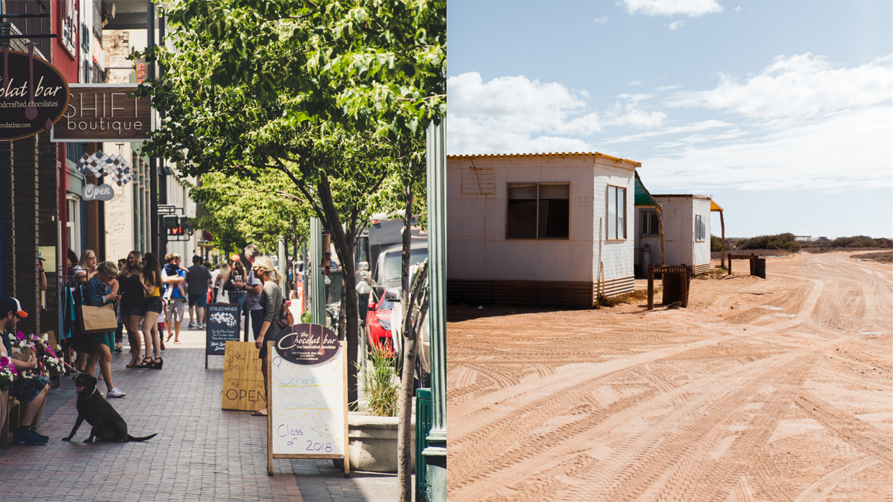
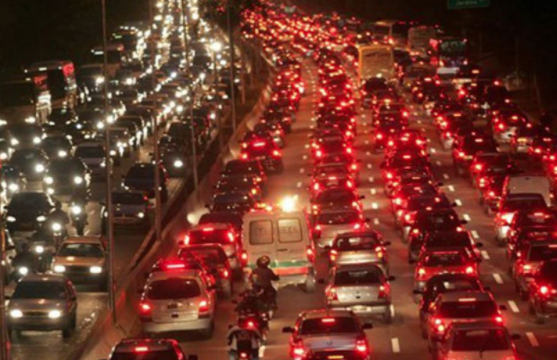
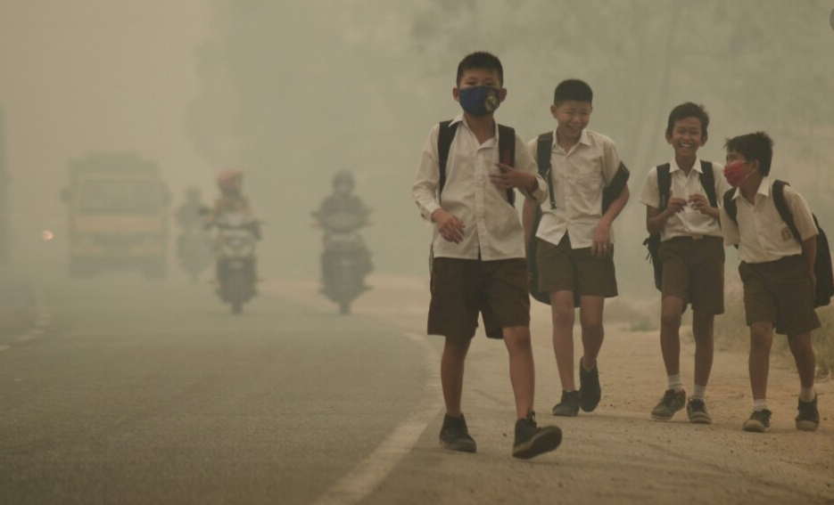
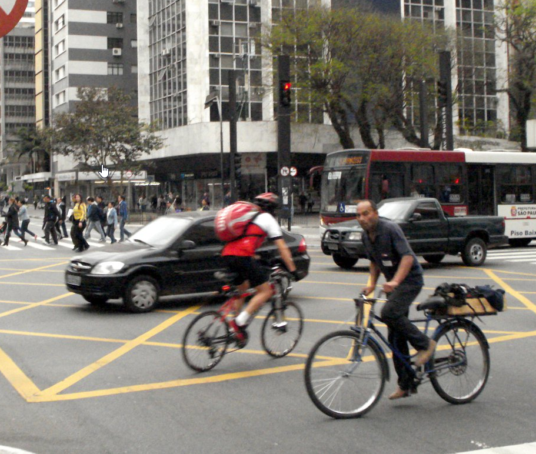
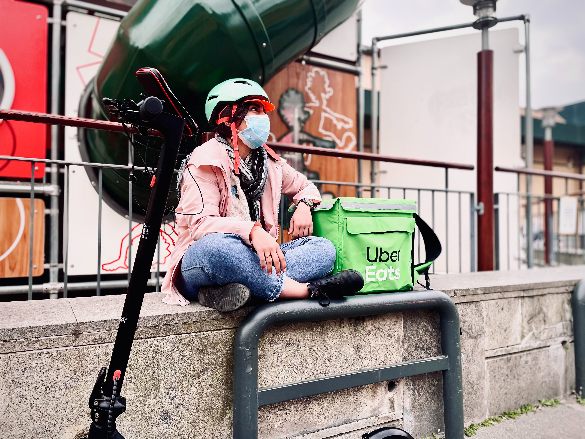
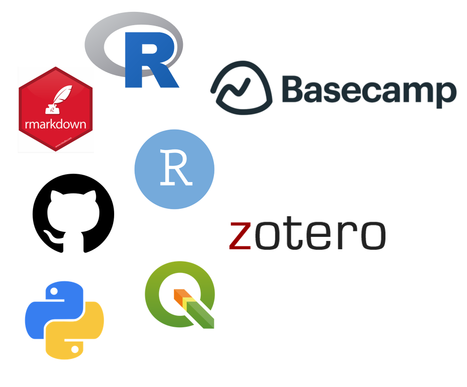
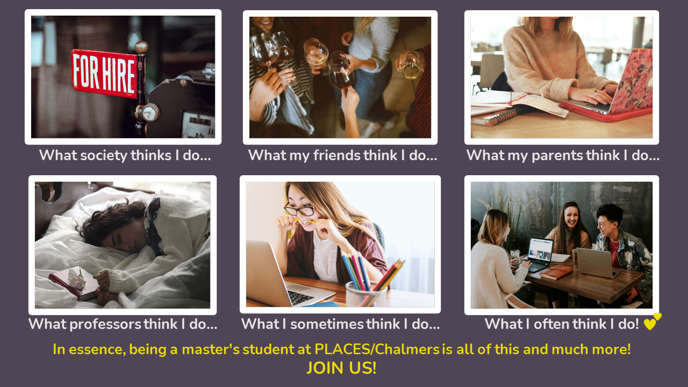

```{r child = "setup.Rmd"}
```

```{r xaringan-logo, echo=FALSE}
#xaringanExtra::use_logo(image_url = "img/Image2.png")
```

```{r echo=FALSE}
xaringanExtra::use_panelset()
```

class: middle
background-image: url(img/imagem3.png)
background-size: contain

.huge[
.center[
Why should you work in our research group to develop your thesis?
]]

.purple[
.bigger[
**Lecture for the position "Assistant Professor progressing the transition to future transport solutions"**
]]


.purple[
Renata Oliveira   
25/05/2022
]

???

Try to put your research in a broader context and explain why it is relevant and important. Give examples of what a master thesis in this area might enable the students to do in the future and try to share your enthusiasm about the subject.

---
class: inverse, center, middle
background-image: url(img/fundo1.png)
background-size: cover

.center[
# What challenges do you and your city face on a daily basis?
]

---

class: middle
background-image: url(img/fundo2.png)
background-size: cover

.panelset.sideways[

.panel[.panel-name[Inequitable access]
### Inequitable access
```{r echo=FALSE, out.width="80%"}

```

]

.panel[.panel-name[Hard commuting]
### Hard commuting
```{r echo=FALSE, out.width="100%"}

```

]
.panel[.panel-name[Unwalkable neighborhoods]
### Unwalkable neighborhoods
```{r echo=FALSE, out.width="70%"}

```

]
.panel[.panel-name[Delivery delays]
### Delivery delays
```{r echo=FALSE, out.width="80%"}
knitr::include_graphics("img/claudio-schwarz-q8kR_ie6WnI-unsplash.jpg")
```

]

.panel[.panel-name[Air and noise pollution]
### Air and noise pollution
```{r echo=FALSE, out.width="80%"}

```
]

.panel[.panel-name[Safety issues]
### Safety issues
```{r echo=FALSE, out.width="70%"}

```
]

.panel[.panel-name[Cold meals, gig economy and labor precarization]
### Cold meals, gig economy and labor precarization
```{r echo=FALSE, out.width="70%"}

```

]

.panel[.panel-name[Imbalance between demand and supply]
### Imbalance between demand and supply
```{r echo=FALSE, out.width="80%"}
knitr::include_graphics("img/wesley-tingey-DBu9IrkuPFM-unsplash.jpg")
```
]
]

???

Maybe you haven't experienced all theses situations, but you surely know what it is about and how it affect people's lives. 

Mobility of people and availability of goods is a fundamental part of the modern society and generates tremendous economic and social value. However, growing transport volumes pose challenges such as climate change, environmental pollution and traffic accidents.

The profile includes two highly interrelated areas, reflecting two main perspectives, where researchers meet to jointly develop multidisciplinary research, education and innovation. These areas are demand for transport and logistics and supply of transport and logistics

So, we address these Sustainable Development Goals: 


SDG 9 - Industry, innovation and infrastructure
Redefining urban development strategies for effective and efficient future mobility solutions.
Investigating the role of new technology for making goods transport more efficient.

SDG 11 - Sustainable cities and communities   

Virtual multimodal infrastructure for smart cities, providing more reliable and responsive transportation services, and thus improving the lives of urban dwellers.
Development of an electrical ferry, contributing to reduced pollution in cities.
A common framework of concepts and methods to investigate how sustainable modes of individual, non-motorized and collective motorized mobility have come into conflict with modern car-dominated urban city planning and traffic engineering.
Enabling cities/municipalities to evaluate the different scenarios of a mixed vehicular traffic and their impact on traffic safety and efficiency.
Researching the transition to sustainable business practices for retailing and transport as well as to sustainable consumer behaviour.

---


background-image: url(img/fundo2.png)
background-size: cover

## PLACES - PLanning for ACcESs Research Group
### Investigation objectives 

.purple[.big[
- Create the potential for **effective**, **sustainable** and **social responsible** urban solutions;
]]

???

--

.purple[.big[
- Enhance **livability**, **equitable access to opportunities**, **social justice** and **quality of life** in cities through the **coordination** among **mobility systems**, **land use** and the **spatial structure of urban activities and functions**;  
]]

???

Integrate transportation planning with other urban subsystems such as land use, the spatial structure of urban activities and functions

--

.purple[.big[
- **Characterise**, **diagnose** and **assess** the relationship between **production, distribution and consumption structures** on **inequitable access to food, other essential goods and urban functions**  
]]


--

.purple[.big[
- Investigate **causal** relationships among **urban logistics** systems and the **urban spatial structure**, identifying relevant factors that **drive demand for goods**, considering the **customer as an active agent** in urban logistics.
]]

---

background-image: url(img/fundo2.png)
background-size: cover

## Learning foundations and competence acquisition
```{r message=FALSE, warning=FALSE, include=FALSE}
library(hexSticker)
```


.pull-left[
.bigger[
- Reproducible and collaborative research
- Spatial econometrics
- Causal inference
- Graphs, networks, interactions and cities as complex systems
- Data analytics, geocomputation and simulation
]]

.pull-right[

```{r echo=FALSE, message=FALSE, warning=FALSE, out.width="70%"}

```
]

.center[.bigger[
METHODS AND BEHAVIOURAL SKILLS TO ADDRESS COMPLEX SOCIETY AND INDUSTRY PROBLEMS   
]]


???

**The world needs you!!!!**

---
background-image: url(img/fundo2.png)
background-size: cover

## PLACES - PLanning for ACcESs Research Group
### Main departments exchanging knowledge and collaborating with PLACES

Department | Collaboration
-----------|--------------
Architecture and Civil Engineering | Urban Design and Planning, Urban and Regional Transformations, Cities and Complexity, Urban Functional and Morphological structures, Geocomputation 
Technology Management and Economics | Operations and Supply Chain Management, Entrepreneuship and informal labour, inequality measures, urban accessibility as the aim of urban planning and public policy
Computer Science and Engineering | Data Analytics, Geocomputation, Theoretical ML research for decision-making, natural language processing to support qualitative methods
Communication and Learning in Science | Support on research communication to broader audiences, data curation and compliance with GDPR and Open Science efforts
Space Earth and Environment (SEE) | Behaviour, energy, emmissions, travel demand, travel behaviour, modelling and simulation

???
GDPR - General Data Protection Regulation


---

class: left
background-image: url(img/fundo2.png)
background-size: cover

## My personal objectives!!!! ❤️ ❤️ ❤️ ❤️ ❤️ 

.pull-left[
.middle[
```{r echo=FALSE, message=FALSE, warning=FALSE, out.width="100%"}
knitr::include_graphics("img/lovelearn.jpg")
```
]]

.pull-right[
```{r echo=FALSE, message=FALSE, warning=FALSE, out.width="67%"}

```
]

---

background-image: url(img/fundo2.png)
background-size: cover

.center[
## Projects waiting for us!!!
]

.bigger[
**Trip chaining** to access **pickup points**
]
Customer as an active agent in urban logistics solutions + network analysis + origin and destination surveys + data collection and analytics + geocomputation

--

.bigger[
**Dark kitchens and on-demand delivery** 
]
Urban logistics + inequalities measures regarding access to food systems + urban structure and quality of life + labour precarization + geocomputation + long term impact in cities livability (modeling and simulation)

--

.bigger[
**Accessibility of logistics facilities for Last-mile delivery**
]
Urban logistics + inequalities measures regarding access to goods + logistics facilities + location theory and methods + geocomputation

???

- Assessing **trip chaining** to access **pickup points** - **customer** as an **active agent** in urban logistics solutions

- The impacts of **Dark kitchens and on-demand delivery** regarding (i) **inequalities of access to food products** in urban areas; (ii) pressures on the **urban structure and quality of life**; (iii) **labour precarization**
      
- Understanding how the **accessibility of logistics facilities for Last-mile delivery** 
can contribute to **equitable access to goods**. We can focus on **food systems** and explore central places theory (Christaller, 1966) 

- **Measuring** the **impacts** of **local production and consumption** arrangements on **social justice**. Would you be interested in exploring **Urban Agriculture**?

- Characterization and diagnosis of **home delivery demand** - Let's investigate the decision process through **causal relationships** among **urban structure** elements, **customer profile, residence/work location, and willingness to collect** products in collection sites.


---
background-image: url(img/fundo2.png)
background-size: cover

.center[
## Projects waiting for us!!!
]

.bigger[
**Impacts** of **local production and consumption** on **social justice**
]
Supply Chain Management + food systems + inequality and accessibility measures + Urban agriculture + LCA 

--

.bigger[
**Home delivery demand**
]
Causal inference + geocomputation + urban structure + customer profile, residence/work location, and willingness to collect goods 

---

background-image: url(img/fundo2.png)
background-size: cover

.center[
## Projects waiting for us!!!
]


.bigger[
**Urban characteristics**, **real estate market** and **spatial patterns of logistics facilities**
]
Urban logistics + data scrapping + data analytics + geocomputation + morphology and functional urban structure

--

.bigger[
**Urban centrality measures** as a proxy for **customer accessibility**
]

Spatial big data + open data from collaborative sources such as OpenStreetMap + network centrality measures + accessibility 

.big[.center[.bold[
Remember that we can deepen our investigations comparing different economic contexts (global north and south, for instance!)
]]]

???

- Relationships among **urban characteristics**, **real estate market** and **spatial patterns of logistics facilities** in different geographic contexts.

- Identificação e qualificação de centralidades urbanas por meio de estrutura morfológico-funcional: um estudo de caso para a RMBH. 2020.

Our research group is part of the Transporte, entitle PLACES - Planning for accessibility, 

- Compare **urban centrality measures** and assess them as a proxy for **customer accessibility**. Let's explore spatial big data and collaborative webGIS such as OpenStreetMap. 

---
class: middle, center, inverse
background-image: url(img/fundo1.png)
background-size: cover

```{r echo=FALSE, message=FALSE, warning=FALSE, out.width="90%"}

```

---
class: middle
background-image: url(img/fundo1.png)
background-size: cover

.larger[
.center[
TACK OCH KOM MED OSS!   
THANK YOU AND JOIN US!
]]

&nbsp;
<hr />

<p style="text-align: center;"><span style="color: #ebdb00;"><em>renataoliveira@gmail.com</em></span></p>

<!-- Add icon library -->
<link rel="stylesheet" href="https://cdnjs.cloudflare.com/ajax/libs/font-awesome/4.7.0/css/font-awesome.min.css">

<link rel="stylesheet" href="https://cdn.jsdelivr.net/gh/jpswalsh/academicons@1/css/academicons.min.css">


<!-- Add font awesome icons -->
<p style="text-align: center;">
    <a href="https://twitter.com/retaoliveira?lang=en" class="fa fa-twitter fa-2x"></a>&nbsp;&nbsp;
    <a href="https://github.com/retaoliveira" class="fa fa-github fa-2x"></a>&nbsp;&nbsp;
    <a href="https://scholar.google.com/citations?user=V6EX45EAAAAJ" class="ai ai-google-scholar ai-2x"></a>&nbsp;&nbsp;
    <a href="https://orcid.org/0000-0002-9011-2342" class="ai ai-orcid ai-2x"></a>&nbsp;&nbsp;
    <a href="http://lattes.cnpq.br/2642488704355833" class="ai ai-lattes ai-2x"></a>&nbsp;&nbsp;
    <a href="https://github.com/retaoliveira/relements/raw/main/texto/index.pdf" class="ai ai-cv ai-2x"></a>

</p>

&nbsp;

